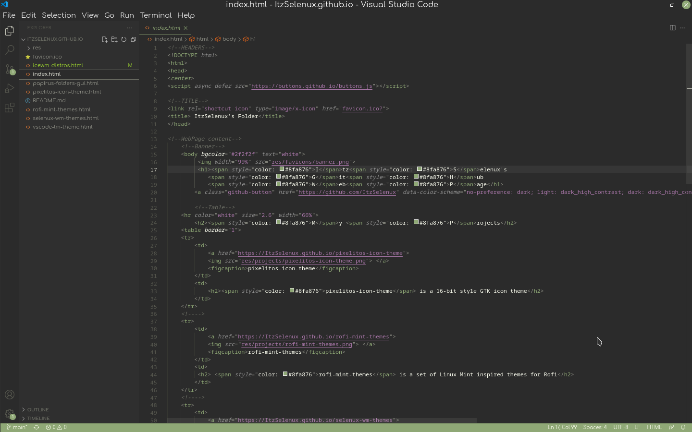

# VSCode Linux Mint Theme

Linux Mint theme for Visual Studio Code

VSCode Marketplace link:
https://marketplace.visualstudio.com/items?itemName=ItzSelenux.lm-theme

``` 
ext install ItzSelenux.lm-theme
```





